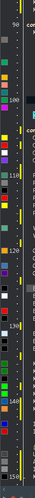

# DelphiColorPreview

A lightweight RAD Studio (Delphi 12 Athens) IDE plugin that shows a **color swatch
in the editor gutter** next to every color literal in your source — like the color
decorators in VS Code — and lets you **Shift+click** a swatch to pick a new color,
rewriting the literal in place.



## Features

- Inline color swatches in the left gutter, on every line that contains a color literal.
- Recognizes three Delphi color forms:

  | Form          | Example                | Notes                                                        |
  |---------------|------------------------|--------------------------------------------------------------|
  | `clXXX`       | `clRed`, `clBtnFace`   | VCL named constants; system colors resolved to their real RGB |
  | `$00BBGGRR`   | `$00FF8040`            | `TColor` hex (BGR byte order); 6–8 hex digits                 |
  | `RGB(r,g,b)`  | `RGB(255, 128, 0)`     | integer-literal arguments only                               |

- **Shift+click** a swatch to open a color picker and rewrite the literal in the same
  form (`$hex` → `$hex`, `RGB()` → `RGB()`, `clXXX` → name when one exists). The change
  goes through the editor buffer, so **Ctrl+Z** undoes it.
- Plain clicks are left untouched, so the gutter keeps working for breakpoints.
- No configuration, no toolbar, no menu — install the package and it just works.

## Requirements

- RAD Studio 12 Athens (Delphi, compiler 36.0 / package version `290`).
- Win32 design-time package (the IDE host is a 32-bit process).

## Installation

1. Build the package (see below) or grab `DelphiColorPreview.bpl`.
2. In the IDE: **Component → Install Packages… → Add…** and select
   `DelphiColorPreview.bpl`.
3. Open any unit with color literals — swatches appear in the gutter.

To uninstall, remove the entry from the same dialog; the editor returns to normal.

## Build from source

Requires RAD Studio 12 on the `PATH` via `rsvars.bat`.

```bat
build.bat
```

`build.bat` calls `rsvars.bat` and runs `msbuild` for the Win32 / Debug configuration,
writing `DelphiColorPreview.bpl` to the IDE's package output folder
(`%BDSCOMMONDIR%\Bpl`, which is on the IDE load path). Then install it as above.

> The package has **no `DllSuffix`** in the project on purpose — the output stays
> `DelphiColorPreview.bpl`. (Setting one makes the IDE reconcile the mismatch by
> renaming the whole project, producing a double-suffixed bpl that won't load.)

## How it works

The package registers a single global `INTACodeEditorEvents` notifier through
`(BorlandIDEServices as INTACodeEditorServices).AddEditorEventsNotifier`.

- Swatches are painted at the `pgsEndPaint` gutter stage, which runs once after the
  whole gutter is drawn with a clip covering the entire gutter. The plugin enumerates
  the visible lines (`EditorState.TopLine..BottomLine` → `LineState[]`) and draws a
  swatch in each line's `GutterRect`. Using the line's own gutter rectangle means there
  is no column-to-pixel math, so the swatch never drifts.
- Line text and geometry come straight from `INTACodeEditorLineState` (`.Text`,
  `.GutterRect`).
- Editing goes through `IOTAEditView.Buffer.EditPosition` (`Move` / `Delete` /
  `InsertText`) so the IDE records a normal, undoable edit.

### Source layout

| File                         | Responsibility                                              |
|------------------------------|-------------------------------------------------------------|
| `ColorPreview.Parser.pas`    | `FindColorTokens` — scans one line into color tokens        |
| `ColorPreview.Notifier.pas`  | `TColorPreviewNotifier` — paints swatches, handles the click |
| `ColorPreview.Register.pas`  | registers / unregisters the notifier on package load        |
| `DelphiColorPreview.dpk`     | the design-only package (`requires rtl, vcl, designide`)    |

## License

[MIT](LICENSE)
