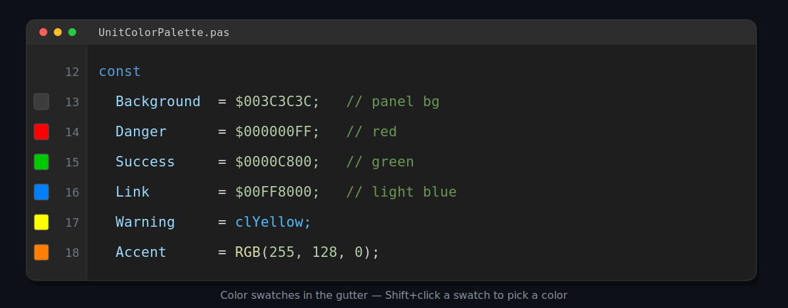
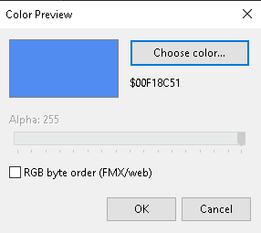

# DelphiColorPreview

A lightweight RAD Studio (Delphi 12 Athens or newer) IDE plugin that shows a **color swatch
in the editor gutter** next to every color literal in your source — like the color
decorators in VS Code — and lets you **Shift+click** a swatch to pick a new color,
rewriting the literal directly in your code. It understands both **VCL** (`TColor`) and
**FMX** (`TAlphaColor`, with an alpha channel) color forms.

## Features

- Color swatches in the left gutter, on every line that contains a color literal.
- Recognizes VCL and FMX color forms:

  | Form                     | Example                     | Notes                                                        |
  |--------------------------|-----------------------------|--------------------------------------------------------------|
  | `clXXX`                  | `clRed`, `clBtnFace`        | VCL named constants; system colors resolved to their real RGB |
  | `RGB(r,g,b)`             | `RGB(255, 128, 0)`          | integer-literal arguments only                               |
  | `$00BBGGRR` hex          | `$00FF8040`                 | 8-digit `$00…` → VCL `TColor` (BGR); auto-detected            |
  | `$AARRGGBB` hex          | `$FF3366CC`, `$80FF0000`    | 8-digit with a non-zero high byte → FMX `TAlphaColor` (ARGB); auto-detected |
  | `$RRGGBB` hex            | `$C0FFEE`                   | 6-digit → BGR or RGB per the byte-order mode (see below)      |
  | `claXXX`                 | `claRed`, `claDodgerblue`   | FMX `TAlphaColor` named constants                            |
  | `TAlphaColorRec.X`       | `TAlphaColorRec.Blue`       | FMX `TAlphaColor` record members                             |
  | `TAlphaColors.X`         | `TAlphaColors.Green`        | FMX `TAlphaColor` record members                             |

- **Byte order is mostly automatic.** Only bare hex is ambiguous (`$RRGGBB` is BGR in VCL,
  RGB in FMX/web), and the plugin resolves it for you:
  - **8-digit hex** is decided by its high byte — `$00BBGGRR` is a VCL `TColor`, while a
    non-zero high byte (`$FF3366CC`, `$80FF0000`) is an FMX `TAlphaColor` (ARGB, with alpha).
    No setting needed.
  - **6-digit hex** has no such tell, so it follows the byte-order mode: **Auto** (the
    default — RGB in FMX units, BGR otherwise, detected from the unit's `uses`), **BGR**, or
    **RGB**. Set it in the picker; the choice is persisted.
  Named constants and `RGB()` always have a fixed order. Existing VCL projects are unaffected.
- **Alpha aware.** Translucent colors render as the color blended over a checkerboard so you
  can see the transparency; alpha is preserved (and editable) when you edit.
- **Themed picker.** The color editor matches the IDE's current theme (light/dark).
- Edit colors straight from the gutter (see Usage).
- One persisted setting (the byte-order mode); no toolbar, no menu — build, install, done.

## Requirements

- **RAD Studio 12 Athens or newer (Delphi 12+).** It relies on the modern
  `ToolsAPI.Editor` code-editor notifier framework (`TNTACodeEditorNotifier`,
  `INTACodeEditorState`, gutter paint stages), which was introduced in 12 — the
  older `INTAEditViewModifier` painting API was deprecated as of 11.3. It is
  therefore **not compatible with Delphi 11 or earlier.**
- Win32 design-time package (the IDE host is a 32-bit process).

> **Delphi 13+:** the source is forward-compatible (it uses only the stable base
> interfaces, which RAD Studio extends additively). Just recompile — a design
> package BPL is locked to its IDE version, so the D12 BPL won't load in D13.
> Open `DelphiColorPreview.dproj` in the newer IDE (it upgrades the project
> automatically) and rebuild.

## Installation

1. Open `DelphiColorPreview.dproj` in RAD Studio 12.
2. **Build** the project.
3. Right-click the project in the Project Manager → **Install**.

That's it — the swatches show up in the editor gutter immediately. To uninstall,
right-click the project → **Uninstall** (or remove it from
*Component → Install Packages…*).

> Prefer the command line? Run `build.bat` (it calls `rsvars.bat` + `msbuild`, Win32 /
> Debug) and then do step 3 in the IDE.

## Usage

- A color swatch appears in the gutter next to every line that has a color literal —
  with or without a breakpoint on that line.
- **Shift+click** a swatch to open the picker:

  

  It has:
  - a **preview** (checkerboard behind translucent colors),
  - a **Choose color…** button that opens the native color dialog for the RGB hue,
  - an **Alpha** slider (enabled for `TAlphaColor` literals),
  - a **Byte order (hex)** selector — **Auto / BGR / RGB**, remembered across IDE restarts
    (only affects 6-digit hex; see Features).
- The picker matches the current IDE theme (light/dark).
- Confirming **rewrites the literal in your code**, keeping its original form:
  - hex stays hex — `$00BBGGRR` (VCL), `$AARRGGBB` (FMX alpha), or `$RRGGBB` per the mode,
  - `RGB(r, g, b)` stays an `RGB()` call,
  - `clXXX` / `claXXX` / `TAlphaColorRec.X` / `TAlphaColors.X` stay the matching named
    constant when one exists (otherwise a hex literal).
- The edit goes through the editor buffer, so **Ctrl+Z** undoes it like any other change.
- A plain (non-Shift) click is left untouched, so the gutter still works for breakpoints.

## How it works

The package registers a single global `INTACodeEditorEvents` notifier through
`(BorlandIDEServices as INTACodeEditorServices).AddEditorEventsNotifier`.

- Swatches are painted at the `pgsEndPaint` gutter stage, which runs once after the
  whole gutter is drawn with a clip covering the entire gutter. The plugin enumerates
  the visible lines (`EditorState.TopLine..BottomLine` → `LineState[]`) and draws a
  swatch in each line's `GutterRect`. Using the line's own gutter rectangle means there
  is no column-to-pixel math, so the swatch never drifts.
- Line text and geometry come straight from `INTACodeEditorLineState` (`.Text`,
  `.GutterRect`).
- Editing goes through `IOTAEditView.Buffer.EditPosition` (`Move` / `Delete` /
  `InsertText`) so the IDE records a normal, undoable edit.
- The **Auto** byte-order mode detects an FMX unit by scanning the top of the active
  buffer (`IOTAEditBuffer.CreateReader`) for an `FMX.` unit reference, cached per file.
- The picker registers itself with `IOTAIDEThemingServices` and calls `ApplyTheme`, so it
  follows the IDE's light/dark theme.

### Source layout

| File                          | Responsibility                                                       |
|-------------------------------|---------------------------------------------------------------------|
| `ColorPreview.Parser.pas`     | `FindColorTokens` — scans one line into color tokens; `FormatColorLiteral` — formats a token back to source |
| `ColorPreview.Render.pas`     | `DrawColorPreview` — solid / checkerboard-blended swatch drawing (shared) |
| `ColorPreview.Settings.pas`   | the persisted byte-order mode (Auto/BGR/RGB) in the IDE registry     |
| `ColorPreview.PickerForm.pas` | the themed custom picker (preview, alpha slider, byte-order selector) |
| `ColorPreview.Notifier.pas`   | `TColorPreviewNotifier` — paints swatches, detects FMX units, handles the click |
| `ColorPreview.Register.pas`   | registers / unregisters the notifier on package load                |
| `DelphiColorPreview.dpk`      | the design-only package (`requires rtl, vcl, designide`)             |

## License

[MIT](LICENSE)
